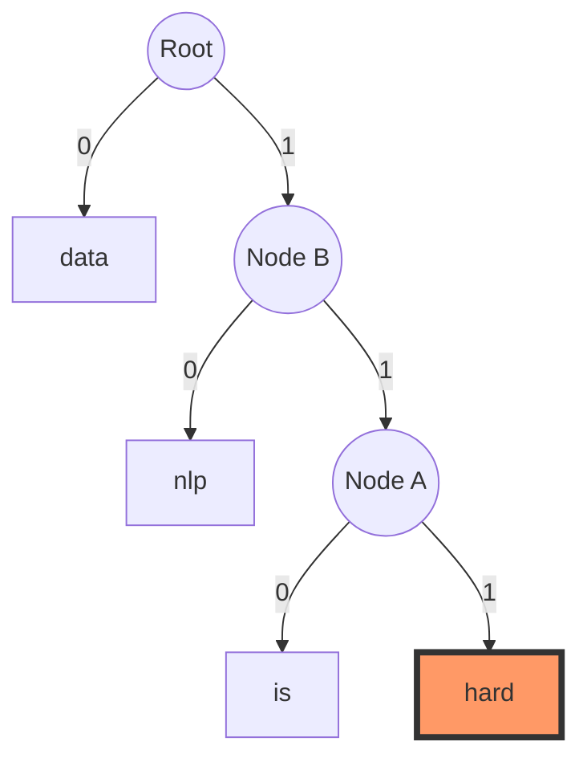

The Distributional Hypothesis is the foundational "philosophy" behind all modern word embeddings (Word2Vec, GloVe, FastText) and even the LLMs

It is best summarized by the famous linguist J.R. Firth (1957): "You shall know a word by the company it keeps."

1. The Core Intuition
In traditional NLP, we treated words as isolated symbols. The model had no idea that "pizza" and "hamburger" were both food. The Distributional Hypothesis argues that the meaning of a word is not an inherent property of the word itself, but a result of the contexts in which it frequently appears.

Example:

"He ate a delicious slice of ______."

"I ordered a large ______ with extra cheese."

Even if you have never seen the word "Pizza," if you see it constantly appearing in these same contexts as "Hamburger" or "Pasta," you (and the mathematical model) can infer that they belong to the same semantic category.

2. How it Works (The Mechanics)
To turn this linguistic theory into math, we follow a three-step process:

Step A: Context Windows
We define a "window size" (e.g., 2 words to the left and 2 to the right). As we slide this window across a massive corpus (like Wikipedia), we record which words appear together.

Step B: Co-occurrence Counting
We build a mental (or actual) matrix. If "Coffee" and "Cup" appear together 10,000 times, but "Coffee" and "Spaceship" appear together 0 times, the statistical link between Coffee and Cup becomes very strong.

Step C: Vector Mapping
The model assigns a random vector (a list of numbers) to every word. It then uses an optimization task (like Word2Vec) to move these vectors in space.

If Word A and Word B share many context words, the model pushes their vectors closer together.

If they never share contexts, their vectors stay far apart.

3. Why is this so powerful?
Because the math is based on context, it automatically captures several layers of meaning without a human ever "teaching" the model:

Synonyms: "Big" and "Large" appear near words like "house," "dog," and "amount." Their vectors will end up nearly identical.

Analogies: The "distance" and "direction" between the vectors for "Man" and "Woman" will be the same as the distance between "King" and "Queen."

Syntax: "Run," "Running," and "Ran" appear in similar sentence structures, so the model learns that they are grammatically related versions of the same concept.

Great article: https://jaketae.github.io/study/word2vec/

We want to achieve with embedding: representing words as dense vectors, a step-up from simple one-hot encoding. This process is exactly what embedding is: as we start training the model with the training data generated above, we would expect the row space of the weight matrix to encode meaningful semantic information from the training data.

Instead of multiplying a One-Hot vector by a Weight Matrix ($1 \times V \cdot V \times D$), we can simply "lookup" the row at the index of the word. This is mathematically identical but computationally much faster

**GloVe: Global Vectors for Word Representation**
1. How GloVe Trains: The Internal WorkingGloVe is a count-based model that operates on the insight that the relationship between words can be captured by the ratios of their co-occurrence probabilities with other "probe" words.
The Training Process:Constructing the Co-occurrence Matrix ($X$): The model first scans the entire corpus once to build a global matrix where each entry $X_{ij}$ represents how many times word $i$ appeared in the context of word $j$.Probability Ratios: Instead of just looking at raw counts, GloVe looks at the ratio of probabilities. 
For example, if you want to distinguish "ice" and "steam," you look at their co-occurrence with "solid." $P(\text{solid}|\text{ice})$ will be high, while $P(\text{solid}|\text{steam})$ will be low. The ratio $P(\text{solid}|\text{ice}) / P(\text{solid}|\text{steam})$ will be very large, clearly distinguishing the two.Objective Function (Weighted Least Squares): GloVe optimizes word vectors ($w_i, w_j$) and biases ($b_i, b_j$) to minimize this loss:$$J = \sum_{i,j=1}^{V} f(X_{ij}) (w_i^T \tilde{w}_j + b_i + \tilde{b}_j - \log X_{ij})^2$$$f(X_{ij})$ is a weighting function: It prevents common words like "the" or "is" from dominating the training and prevents rare words from being ignored.

2. The Mathematical Explanation
The magic of GloVe lies in Probability Ratios, not just raw counts.The Intuition: The "Probe Word" Example
Let's take two words: $i = \text{ice}$ and $j = \text{steam}$. We want to understand their relationship using a "probe word" $k$.Probability & Ratiok=solidk=gask=waterk=fashion$P(k \mid \text{ice})$HighLowHighLow$P(k \mid \text{steam})$LowHighHighLowRatio ($P_{ik} / P_{jk}$)LargeSmall$\approx 1$$\approx 1$If the ratio is large, the probe word is related to ice but not steam.If the ratio is small, it's related to steam but not ice.If it’s near 1, it's either related to both (water) or neither (fashion).The Model EquationGloVe tries to force the dot product of two word vectors to equal the log of their co-occurrence count:$$w_i^T \tilde{w}_j + b_i + \tilde{b}_j = \log(X_{ij})$$The Loss FunctionTo prevent "exploding" counts from rare or common words, GloVe uses a Weighted Least Squares objective:$$J = \sum_{i,j=1}^{V} f(X_{ij}) (w_i^T \tilde{w}_j + b_i + \tilde{b}_j - \log X_{ij})^2$$The function $f(X_{ij})$ is a "cap"—if words appear together a billion times, it treats them with a maximum weight so they don't drown out the rest of the vocabulary.

Feature,Word2Vec (Skip-gram/CBOW),GloVe
Philosophy,Predictive: Learns by trying to predict a word from its neighbors.,Statistical: Learns by factorizing global co-occurrence counts.
Time Complexity,O(C×E): Linear to corpus size C times number of epochs E.,"O(C)+O(Vw): Linear scan for C, then training on non-zero entries (where w≈1.6)."
Space Complexity,O(V×D): Only needs to store the word vectors for vocabulary V of dimension D.,O(V×D)+O(V2): Needs extra space to store the co-occurrence matrix (though it's stored sparsely).
Scaling,Scales linearly with corpus size. Very slow on massive datasets.,Scales with vocabulary size. Extremely fast for huge corpora once the matrix is built.

Summary: Word2Vec captures local nuances better because it observes every specific context window, but GloVe captures global semantic relationships more effectively because it sees the "big picture" statistics of the entire dataset at once.

**FastText: Character n-grams**
1. What it does: The Subword Revolution
In Word2Vec and GloVe, each word is an independent entity. If the model sees "walking" and "walked," it treats them as two completely different symbols. FastText, however, treats a word as a bag of character n-grams.For example, if we use $n=3$ (trigrams) for the word "apple":Subwords: <ap, app, ppl, ple, le>Special Boundary: The symbols < and > are added to distinguish prefixes and suffixes from internal character sequences.Whole Word: The original word <apple> is also included in the bag.
2. How it works in the Background
When FastText calculates the vector for a word, it doesn't just look up one row in a matrix. It retrieves the vectors for all the character n-grams that make up that word and sums them up.$$\mathbf{v}_{word} = \sum_{g \in G_{word}} \mathbf{z}_g$$Where $G_{word}$ is the set of n-grams for that word, and $\mathbf{z}_g$ is the vector for each n-gram. This means the "meaning" of a word is literally the sum of the meanings of its parts.

3. How it Trains
The training objective is identical to Word2Vec's Skip-gram or CBOW (predicting context words).The Difference: Instead of calculating the dot product between a target word vector and context vectors, it calculates the dot product between the sum of subword vectors and the context vectors.Optimization: It uses Negative Sampling or Hierarchical Softmax to maintain speed despite the massive number of subwords.
4. Complexity Analysis
MetricComplexity / RequirementTraining TimeHigher than Word2Vec. Because it must update multiple n-gram vectors for every single word update, it is significantly slower to train.Inference TimeSlightly Slower. At runtime, it has to perform a summation of subword vectors rather than a simple index lookup.Space (Memory)Very High. Storing vectors for millions of n-grams (instead of just words) requires massive RAM. For example, a 2M word vocabulary might result in 10M+ subword vectors.
5. The "Good" vs. The "Bad"
The Good (Pros)
Out-of-Vocabulary (OOV) Support: This is the "killer feature." Even if the model has never seen the word "biomedical," it can construct a vector for it by summing subwords like bio, med, and cal.Rare Word Performance: It captures the meaning of rare words better by learning from common subword patterns (e.g., learning about "unbelievable" through the prefix un- found in "unhappy").Morphologically Rich Languages: It performs exceptionally well for languages like Hindi, German, or Turkish, where word meanings change significantly with prefixes and suffixes.

The Bad (Cons)
Memory Bloat: The model files are much larger than Word2Vec or GloVe due to the subword dictionary.Lack of Global Stats: Like Word2Vec, it is a predictive "local" model and doesn't capture the global corpus statistics as effectively as GloVe.Computational Cost: The increased complexity makes it more expensive to train from scratch on massive datasets.

Feature,Word2Vec,GloVe,FastText
Basic Unit,Whole Word (Atomic),Whole Word (Atomic),Character n-grams (Subword)
OOV Handling,None. Returns error or <UNK>.,None. Returns error or <UNK>.,Excellent. Can construct vectors for new words.
Training Basis,Predictive (Local Context),Statistical (Global Counts),Predictive (Local + Subwords)
Best For,General semantic relationships.,Global co-occurrence patterns.,Morphologically rich languages and messy text.

They are **different** mathematical approaches to solving the same computational bottleneck, and they definitely aren't exclusive to FastText. In fact, they were originally popularized by **Word2Vec** to make training on massive vocabularies feasible.

### **The Problem: The Softmax Bottleneck**

In a standard neural network, the final layer uses a **Softmax** function to calculate the probability of a word. If your vocabulary ($V$) is 1 million words, the model has to calculate a score for *all* 1 million words just to update the weights for *one* target word. This is $O(V)$ complexity—computationally expensive and slow.

---

### **1. Hierarchical Softmax: The Binary Tree Approach**

Instead of evaluating all $V$ words, Hierarchical Softmax organizes the vocabulary into a **Binary Tree** (specifically a **Huffman Tree** based on word frequency).

* **How it works:** To predict a word, the model doesn't look at the whole list. It starts at the root of the tree and makes a series of binary decisions (Left or Right?) until it reaches the specific leaf node (the word).
* **The Math:** Instead of $V$ calculations, you only perform $\log_2(V)$ calculations. For a 1-million-word vocabulary, that's roughly **20** steps instead of **1,000,000**.
* **Key Detail:** Each internal node in the tree has its own learned vector, and the model uses a sigmoid function at each branch to decide the path.

### **2. Negative Sampling: The Binary Classification Hack**

Negative Sampling (NEG) takes a completely different "shortcut." Instead of trying to predict the *correct* word out of 1 million, it turns the problem into a simple **Yes/No** question.

* **How it works:**
1. Take a "Positive" pair (the actual target word and its context word).
2. Pick $k$ "Negative" samples (random words from the dictionary that *don't* appear in that context).
3. Train the model to distinguish the positive pair from the $k$ negative ones using a binary logistic regression (sigmoid) loss.


* **The Math:** You only update the weights for the target word and the $k$ noise words. Usually, $k$ is between 5 and 20.
* **Key Detail:** It doesn't actually approximate the full Softmax perfectly (like Hierarchical Softmax does), but it produces high-quality word vectors much faster.

---

### **Comparison Table**

| Feature | Hierarchical Softmax | Negative Sampling |
| --- | --- | --- |
| **Logic** | Tree-based pathfinding. | Binary classification (Real vs. Noise). |
| **Complexity** | $O(\log V)$ | $O(k)$ where $k$ is small (e.g., 5). |
| **Performance** | Better for rare words. | Better for frequent words & large datasets. |
| **Mathematical Nature** | True Softmax approximation. | Simplified "hack" that works in practice. |

---

### **Are they used elsewhere?**

Yes. While they are the "engines" for **Word2Vec** and **FastText**, the concepts have spread:

* **Word2Vec:** The original implementation (by Mikolov et al.) offered both as options.
* **FastText:** Inherited both from Word2Vec but applies them to **subwords** (n-grams).
* **Recommender Systems:** Negative sampling is widely used in "Item2Vec" or recommendation models to distinguish items a user liked from a random set of items they didn't interact with.
* **Language Models:** Early neural language models used Hierarchical Softmax before GPUs became powerful enough to handle larger Softmax layers or specialized kernels.

To understand **Hierarchical Softmax**, think of it as moving from a "flat" list where you have to check every single item to a "decision tree" where you only make a few strategic choices to find what you need.

### **1. How the Huffman Tree is Built**

In word embeddings, we don't just use any binary tree; we use a **Huffman Tree**. This ensures that frequently used words (like "the" or "is") are closer to the root, requiring fewer calculations, while rare words are deeper in the tree.

#### **The Construction Process (Step-by-Step):**

1. **Count Frequencies:** List all words in your vocabulary with their corpus frequencies.
2. **Initialize Forest:** Treat each word as a leaf node (a "mini-tree").
3. **Merge the Smallest:** Pick the two nodes with the **lowest frequencies** and merge them into a new internal node. The frequency of this new node is the sum of its children.
4. **Repeat:** Continue merging the two smallest available nodes until only one "Root" node remains.

**Visualization of building a tree for 4 words:**

* *Words:* "data" (40), "nlp" (30), "is" (20), "hard" (10)

```text
Step 1: [hard:10], [is:20], [nlp:30], [data:40]
Step 2: Merge (hard, is) -> Node_A (30). 
        Current nodes: [nlp:30], [Node_A:30], [data:40]
Step 3: Merge (nlp, Node_A) -> Node_B (60).
        Current nodes: [data:40], [Node_B:60]
Step 4: Merge (data, Node_B) -> Root (100).

```

---

### **2. The "Pathfinding" Logic Diagram**

Once the tree is built, every **internal node** (the circles) acts as a binary classifier. Instead of a single massive Softmax output, the model learns a vector for every internal node to decide whether the path should go **Left (0)** or **Right (1)**.

#### **Pathfinding for the word "hard":**

To calculate the probability of the word "hard," the model only needs to visit the nodes on its specific path from the Root.



* **Path to "hard":** Root → Right(1) → Node B → Right(1) → Node A → Right(1).
* **Total Decisions:** Only **3** binary decisions instead of checking **4** words.
* **In a real vocab of 1,000,000 words:** You would only make $\approx 20$ decisions ($log_2(1,000,000)$).

---

### **3. The Mathematical "Path" Calculation**

At each internal node $n$ on the path to word $w$, we calculate the probability of taking the correct turn using a sigmoid function:

$$P(\text{turn}) = \sigma(\mathbf{h}^T \theta_n)$$

Where:

* $\mathbf{h}$ is the hidden layer vector (the "input" representation).
* $\theta_n$ is the **learned vector** specifically for that internal node.
* $\sigma$ is the sigmoid function, which outputs a value between 0 and 1.

The final probability of the word is the **product** of the probabilities of all correct turns:


$$P(w | w_{context}) = \prod_{j=1}^{L(w)-1} P(\text{turn}_j)$$

---

### **Summary: Why this is Efficient**

* **Traditional Softmax:** Complexity is $O(V)$. You must compute a dot product for every single word in the vocabulary to normalize the probabilities.
* **Hierarchical Softmax:** Complexity is $O(\log V)$. You only compute dot products for the nodes along the path to your target word.

> **Note:** Because the Huffman tree puts frequent words at the top, the *average* path length is actually even shorter than $\log V$, making it incredibly fast for datasets dominated by common words.

It is called **Negative Sampling** because, rather than adjusting the weights for every word in the vocabulary during a single training step, the model only "samples" a few **negative** (noise) examples to update.

In a standard Softmax approach, the model treats the entire vocabulary (often 100,000+ words) as the "not-the-word" class, which is computationally expensive ($O(V)$). Negative Sampling simplifies this into a binary classification problem: **"Is this word-context pair real or noise?"**.

---

### **How it Works: An Example**

Consider the sentence: *"The scientist is coding in Python."*

* **Target Word:** "coding".
* **Positive Context Word (Real):** "scientist".

#### **1. Sampling the "Negative" Words**

The algorithm randomly selects $k$ words (usually between 5 and 20) from the vocabulary that do **not** appear in the current context.

* **Negative Samples:** "bicycle", "galaxy", "pancake", "volcano", "umbrella".

#### **2. The Binary Task**

The model is now trained to solve a simple "Yes/No" task for these $k+1$ pairs:

* (coding, scientist) $\rightarrow$ **1** (Yes, this is a real context).
* (coding, bicycle) $\rightarrow$ **0** (No, this is noise).
* (coding, galaxy) $\rightarrow$ **0** (No, this is noise).
* ...and so on for all $k$ negative samples.

#### **3. The Math of the Update**

The objective function maximizes the probability of the positive pair while minimizing the probability of the negative ones using the sigmoid function $\sigma$:

$$\mathcal{L} = \log \sigma(v_{pos}^\top v_{target}) + \sum_{i=1}^k \log \sigma(-v_{neg_i}^\top v_{target})$$

Because you only update the vectors for "coding", "scientist", and your 5 "negative" words, the complexity drops from $O(V)$ to **$O(k)$**.

---

### **Comparison: Negative Sampling vs. Hierarchical Softmax**

Both are used to solve the $O(V)$ bottleneck, but they use different logic to get there.

| Feature | Hierarchical Softmax (HS) | Negative Sampling (NEG) |
| --- | --- | --- |
| **Strategy** | **Structural:** Uses a Huffman Binary Tree to partition the vocabulary. | **Stochastic:** Uses a "Binary Classification" task with sampled noise words. |
| **Complexity** | $O(\log V)$—the depth of the tree. | $O(k)$—the number of negative samples chosen. |
| **Probability** | It is a mathematically well-defined approximation of the full Softmax (it sums to 1). | It is a heuristic; it doesn't aim to be a perfect probability distribution, just a way to learn good vectors. |
| **Best For** | **Rare words.** The tree structure allows rare words to benefit from the paths of common words. | **Frequent words.** It is faster to train and often produces better vectors for large datasets. |
| **Training Unit** | Updates internal nodes along the path to the leaf. | Updates the target word and the specific noise word vectors sampled. |

---

### **Which one is used in practice?**

In most modern implementations like **FastText** or **Word2Vec** (Gensim), **Negative Sampling** is the default choice. It is generally faster on modern hardware and produces highly robust embeddings for most NLP tasks.


**Overall**
## 1. The Core Philosophy: The Distributional Hypothesis

The transition from representing words as isolated symbols to dense vectors is based on the **Distributional Hypothesis**: "Words that appear in similar contexts share similar meanings."

* **Context Windows:** Meaning is derived by sliding a window across a corpus and observing neighboring words.
* **Vector Mapping:** The goal of embedding models is to map words into a continuous vector space where the mathematical distance reflects semantic similarity.

---

## 2. The Embedding Trio: Architectural Deep Dive

### A. Word2Vec (The Predictive Pioneer)

Word2Vec treats word embedding as a "fake" prediction task. It uses a shallow neural network to learn weights that are later used as embeddings.

* **CBOW (Continuous Bag of Words):** Predicts a target word based on the sum of its surrounding context words.
* **Skip-gram:** Predicts surrounding context words given a single target word.
* *Insight:* Skip-gram is generally slower but superior at capturing representations for rare words.


### B. GloVe (The Global Statistician)

**Global Vectors for Word Representation** shifts the focus from local prediction to global corpus statistics.

* **Mechanism:** It constructs a massive **Global Co-occurrence Matrix** ($X$) where $X_{ij}$ is the count of how often word $j$ appears in the context of word $i$.
* **Probability Ratios:** It focuses on the ratios of co-occurrence probabilities to distinguish nuanced meanings (e.g., distinguishing "ice" from "steam" using the probe word "solid").
* **Objective Function:** GloVe uses a weighted least squares regression model to minimize the difference between the dot product of vectors and the log of their co-occurrence counts.

### C. FastText (The Subword Specialist)

Developed to solve the "atomic word" problem, FastText breaks words down into **character n-grams**.

* **Logic:** The vector for a word is the sum of the vectors of its constituent n-grams.
* **The OOV Solution:** Because it understands sub-parts (like prefixes and suffixes), it can generate meaningful vectors for **Out-of-Vocabulary (OOV)** words it has never seen before.

---

## 3. Mathematical Foundations

### The Engine: The Dot Product

The "closeness" of two words is determined by the dot product of their vectors. During training, the model nudges vector coordinates to maximize the dot product for words that appear together.


$$\text{Score} = \mathbf{v}_w \cdot \mathbf{v}_c$$

### The Metric: Cosine Similarity

To measure similarity regardless of word frequency (vector magnitude), we use **Cosine Similarity**, which measures the cosine of the angle between two vectors.


$$\text{Similarity} = \frac{\mathbf{A} \cdot \mathbf{B}}{\|\mathbf{A}\| \|\mathbf{B}\|}$$

---

## 4. Complexity & Performance Comparison

| Feature | Word2Vec | GloVe | FastText |
| --- | --- | --- | --- |
| **Philosophy** | Predictive (Local) | Statistical (Global) | Predictive (Subword) |
| **Training Time** | $O(C \times E)$ | $O(C) + O(V^{1.6})$ | Highest (n-gram overhead) |
| **Space (Memory)** | Low ($V \times D$) | Moderate ($V^2$ sparse) | High (millions of n-grams) |
| **OOV Handling** | None (KeyError) | None (KeyError) | Excellent |

---
